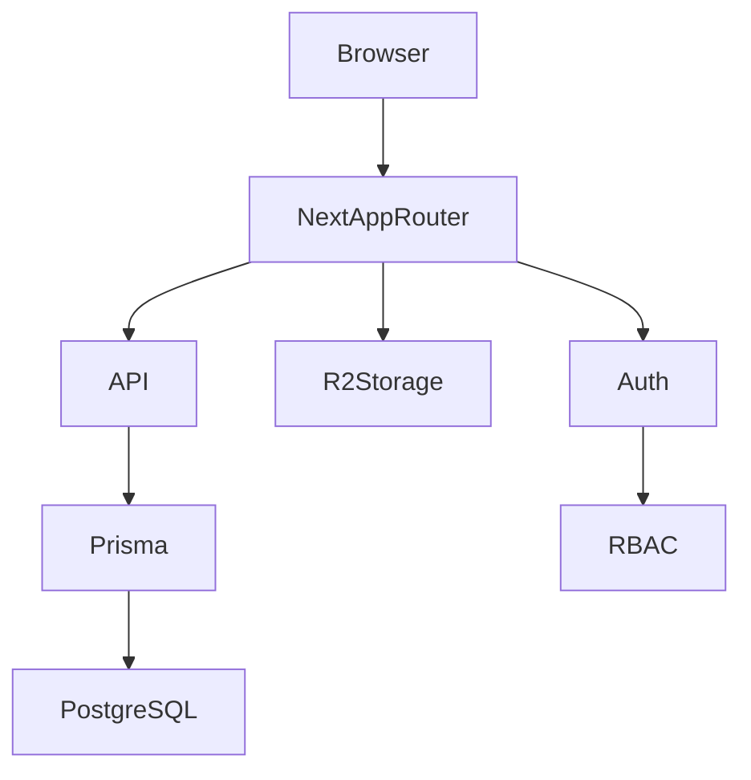
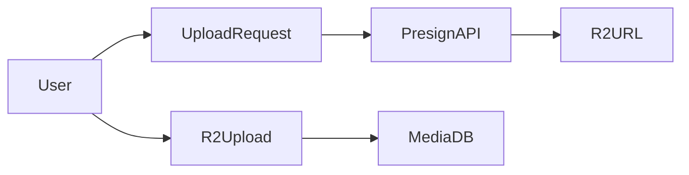
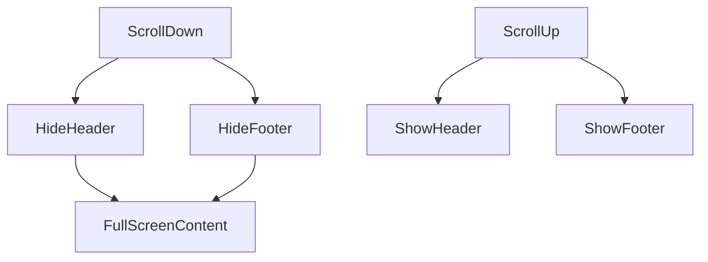
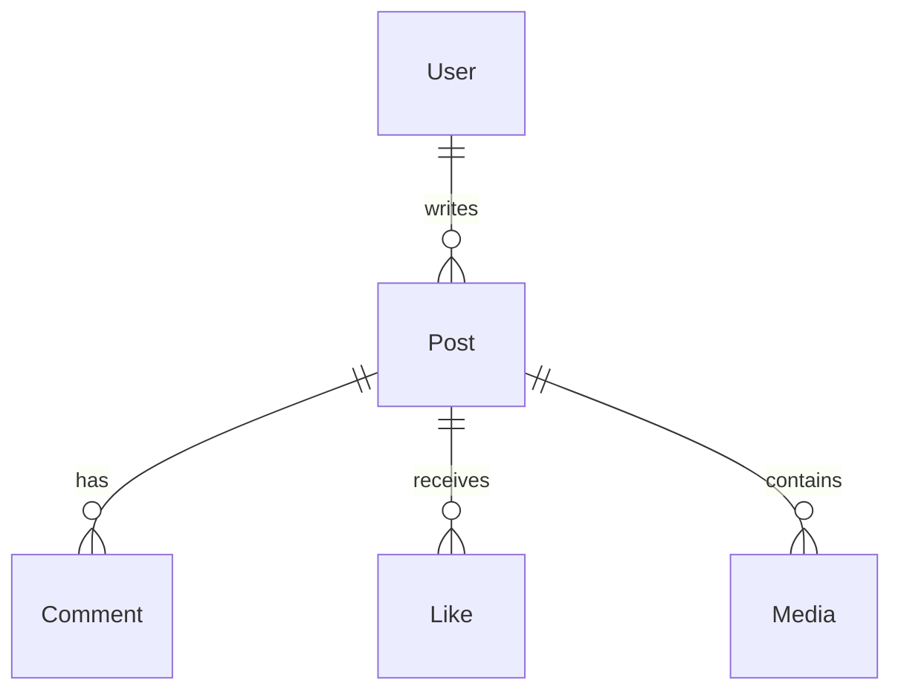

# Allensay_s

Enterprise‑grade membership publishing platform built with **Next.js App Router**.

Allensay_s is designed as a scalable creator‑community platform supporting publishing, interaction, and future creator monetization.

---

# Project Status

Stage: Active Development  
Architecture Level: SaaS‑Ready  
Documentation Level: Enterprise Transfer Document  

---

# Core Goals

Allensay_s aims to become a platform for:

• community publishing  
• creator‑audience interaction  
• membership‑based content  
• future subscription economy  

---

# System Architecture



Stack:

| Layer | Technology |
|------|-------------|
Frontend | Next.js 16 App Router |
Language | TypeScript |
Styling | TailwindCSS |
Auth | NextAuth |
ORM | Prisma |
Database | PostgreSQL (Neon) |
Storage | Cloudflare R2 |
Deployment | Vercel |

---

# Architectural Principles

Allensay_s enforces strict separation between three domains:

1. Access Control
2. Publish Validity
3. Rendering Strategy

These domains must **never be merged**.

---

# RBAC Matrix

| Role | View Public | View Login | Admin Panel | Edit Post | Delete Post |
|-----|-------------|------------|-------------|----------|-------------|
Guest | ✔ | ✖ | ✖ | ✖ | ✖ |
User | ✔ | ✔ | ✖ | ✖ | ✖ |
Admin | ✔ | ✔ | ✔ | ✔ | ✔ |

RBAC must be enforced **server‑side**.

Client RBAC is not trusted.

---

# Visibility / Publish Rule Matrix

| Visibility | Who Can Access | Published Conditions |
|------------|----------------|---------------------|
PUBLIC | Everyone | Must contain text/image/video |
LOGIN_ONLY | Authenticated users | Must contain text/image/video |
ADMIN_ONLY | Admin backend | Optional |
ADMIN_DRAFT | Admin backend | Optional |

Rule:

Published posts **must not be empty**.

---

# Repository Structure

```
app/
  layout.tsx
  page.tsx

  post/
    [id]/

  admin/
    layout.tsx
    posts/

api/
  posts/
  comments/
  likes/
  upload/
  uploads/r2/presign/

components/
lib/
prisma/
public/
```

---

# Route Map

Public Routes

```
/
/post/[id]
/login
/register
```

Admin Routes

```
/admin
/admin/posts
/admin/posts/new
/admin/posts/[id]
/admin/posts/[id]/edit
```

API

```
/api/posts
/api/comments
/api/likes
/api/upload
/api/uploads/r2/presign
```

Cron

```
/api/cron/cleanup-drafts
```

---

# Upload Pipeline



Upload modes

Server Upload  
/api/upload

Direct Upload  
/api/uploads/r2/presign

Future goal

Unified upload pipeline

---

# Mobile Curtain UI Architecture

Mobile UI introduces **dynamic header/footer curtains**.

Inspired by Facebook mobile UX.



Curtain height

~ 1/15 screen height

Header Content

Left:
Allensay_s 社群

Right:
Search Icon  
Admin Icon (admin only)

Footer

Reserved for navigation (future)

---

# Database Schema

## Tables

| Table | Purpose |
|------|---------|
User | platform users |
Post | content posts |
Comment | post comments |
Like | post likes |
Media | uploaded files |

---

## Schema Relationship



---

# Media Storage

Cloudflare R2

Bucket layout

```
media/
   post/
   avatar/
```

---

# Security Model

## Attack Surfaces

Admin API  
Upload endpoints  
Visibility filtering  
Direct ID enumeration  

---

## Threat Types

Privilege escalation  
Media abuse  
MIME spoofing  
ADMIN_ONLY leakage  
Serverless DB exhaustion  

---

## Mitigation

RBAC middleware  
Server validation  
Rate limiting  
Database pooling  

---

# Database Pooling

Current

Prisma global singleton  
Neon pooled endpoint  

Future

pgBouncer  
Prisma Accelerate  

---

# Environment Variables

Required

```
DATABASE_URL

NEXTAUTH_SECRET
NEXTAUTH_URL

R2_ENDPOINT
R2_ACCESS_KEY
R2_SECRET_KEY
R2_BUCKET
```

---

# Deployment

Platform

Vercel

Build

```
prisma generate && next build
```

---

# Development Setup

Clone repo

```
git clone <repo>
```

Install

```
npm install
```

Generate prisma

```
npx prisma generate
```

Run dev

```
npm run dev
```

---

# Contribution Guide

Contribution steps

1. fork repository
2. create feature branch
3. implement feature
4. open pull request

Branch naming

```
feature/xxx
fix/xxx
refactor/xxx
```

Commit style

```
feat:
fix:
refactor:
docs:
```

---

# Production Checklist

Before deploying production

• database migrations applied  
• environment variables configured  
• upload endpoints secured  
• RBAC verified  
• rate limiting enabled  
• cron jobs configured  

---

# Enterprise Roadmap

Phase 0 UI Stabilization

• layout normalization  
• edit page alignment  
• unsaved change guard  
• mobile curtains  

Phase 1 Infrastructure

• upload rate limiting  
• R2 deletion sync  
• monitoring  

Phase 2 Platform Features

• tag system  
• search  
• scheduled publishing  
• membership tiers  

Phase 3 Monetization

• Stripe  
• analytics dashboard  
• paid content  

---

# Critical Invariants

The following rules must never break

ADMIN_ONLY content must never appear on frontend  
PUBLIC posts must not be empty  
visibility must remain separate from rendering  
client RBAC cannot be trusted  
backend preview must remain isolated  

---

# Maintainer

Project

Allensay_s

Architecture

Next.js  
Prisma  
PostgreSQL  
Cloudflare R2  

---

# License

MIT License
