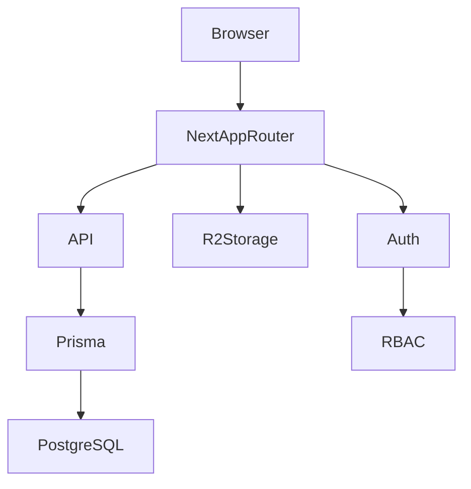
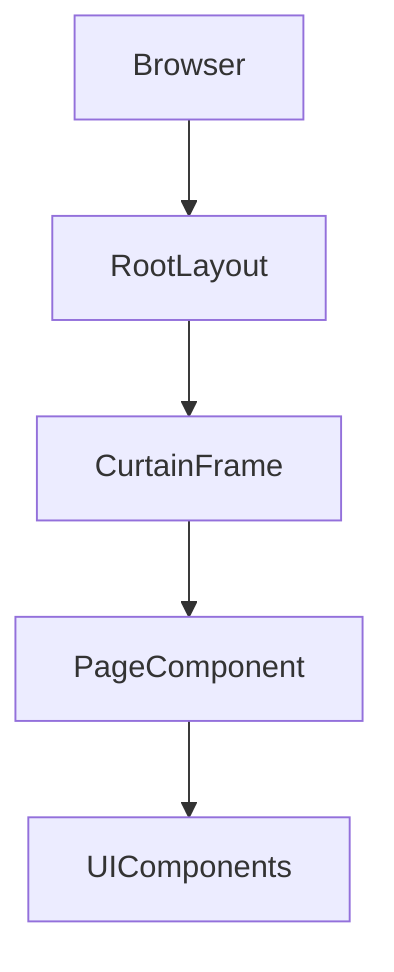
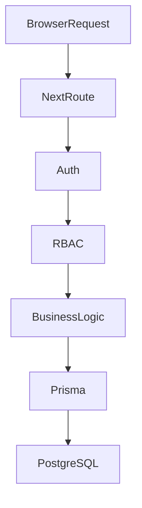

# Architecture

## System Overview

Allensay_s is a membership-based publishing platform built with the Next.js App Router architecture.

The system integrates authentication, database persistence, media storage, and content publishing into a unified SaaS platform.

---

## High Level Architecture

---

## Architectural Principles

The platform enforces strict separation between three domains:

1. Access Control  
2. Publish Validity  
3. Rendering Strategy  

These layers must never be merged.

---

## Access Control

Access Control determines **who can see content**.

Visibility types:

- PUBLIC
- LOGIN_ONLY
- ADMIN_ONLY
- ADMIN_DRAFT

These rules must always be enforced server-side.

---

## Publish Validity

Publish Validity determines **whether a post is considered publishable**.

Rules:

A published post must contain at least one of:

- text
- image
- YouTube content

Empty public posts are not allowed.

---

## Rendering Strategy

Rendering Strategy determines **how content is displayed**.

Examples:

- feed cards
- post detail page
- admin editor
- mobile UI

Rendering must not determine visibility.

---

## Frontend Rendering Flow

---

## Backend Request Flow

Security enforcement occurs before business logic execution.