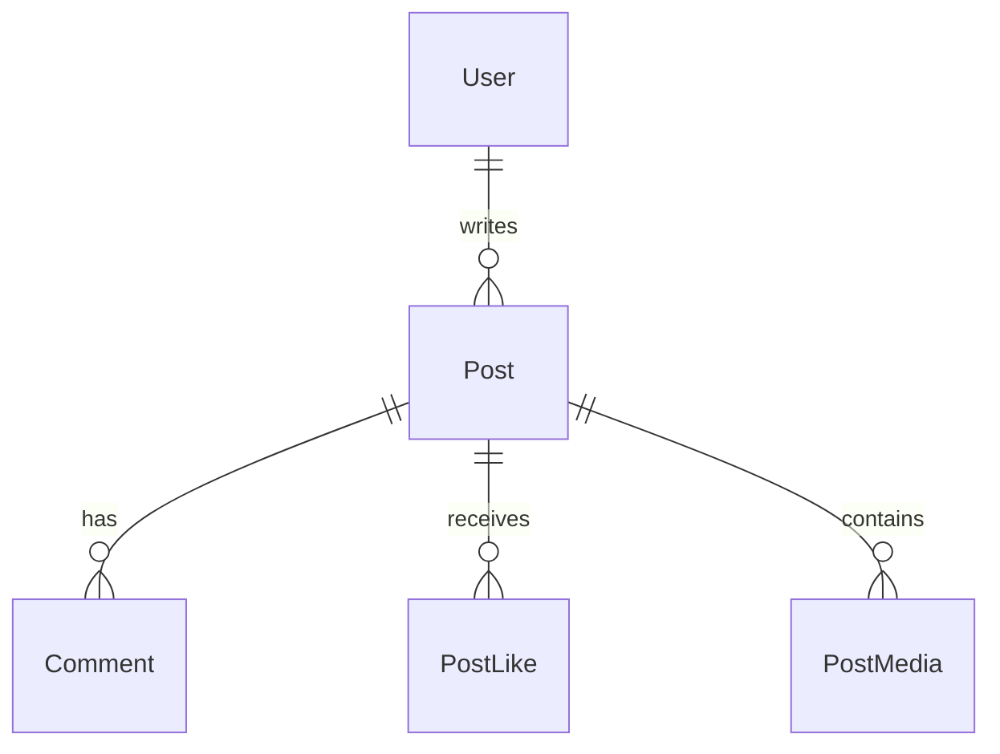

# Database Schema

Database: PostgreSQL  
ORM: Prisma  

---

## Tables

| Table | Purpose |
|------|---------|
User | platform users |
Post | content posts |
Comment | post comments |
PostLike | post likes |
PostMedia | uploaded files |

---

## Entity Relationship

---

## User

Represents authenticated platform users.

Fields include:

- id
- email
- name
- avatarUrl
- role
- status
- createdAt
- updatedAt

Roles:

- USER
- ADMIN

Statuses:

- ACTIVE
- BLOCKED

---

## Post

Represents publishable content.

Key fields:

- authorId
- content
- youtubeUrl
- visibility
- draftExpiresAt
- publishedAt
- createdAt
- updatedAt
- deletedAt

Visibility values:

- PUBLIC
- LOGIN_ONLY
- ADMIN_ONLY
- ADMIN_DRAFT

---

## Comment

Represents user comments on posts.

Fields include:

- postId
- authorId
- content
- createdAt
- deletedAt

---

## PostLike

Represents many-to-many likes.

Composite primary key:

- postId
- userId

---

## PostMedia

Represents uploaded media attached to posts.

Fields include:

- postId
- type
- url
- sortOrder
- createdAt